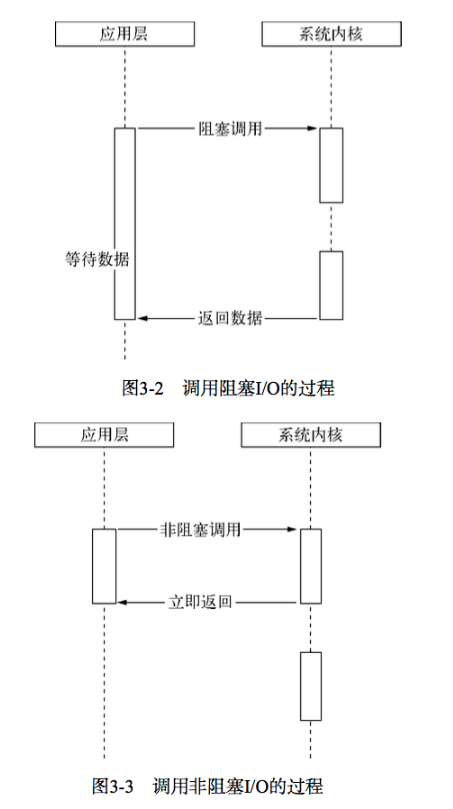
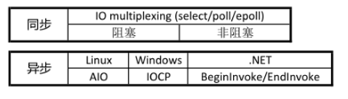
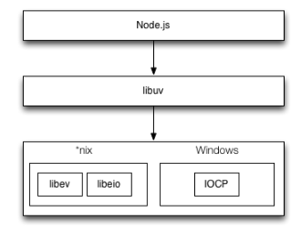

# 异步式IO与事件式编程
阻塞模式下，一个线程只能处理一项任务，想要提高吞吐量必须通过多线程。  
而非阻塞模式下，一个线程永远在执行计算操作，这个线程所使用的`CPU`核心利用率永远是`100%`，`I/O`以事件的方式通知。  
在阻塞模式下，多线程往往能提高系统吞吐量，因为一个线程阻塞时还有其他线程在工作，多线程可以让`CPU`资源不被阻塞中的线程浪费。  
而在非阻塞模式下，线程不会被`I/O`阻塞，永远在利用`CPU`。  
多线程带来的好处仅仅是在多核`CPU`的情况下利用更多的核，  
而`Node.js`的单线程也能带来同样的好处。

## 阻塞和非阻塞
阻塞`I/O`的一个特点是调用之后一定要等到系统内核层面完成所有扣件操作后，调用才结束。  
例如: 读取磁盘上的一段文件为例, 系统内核在完成磁盘寻道, 读取数据, 复制数据到内存中之后, 这才调用完结束.  
阻塞`I/O`造成的`CPU`等待`I/O`,浪费等待时间，`CPU`的处理能力不能得到充分利用为了提高性能，内核提供了非阻塞I/O,  
`非阻塞I/O和阻塞I/O的差别为调用之后会立即返回。`    
  

非阻塞返回之后，CPU的时间片(时间片：是分时操作系统分配给每个正在运行的进程微观上的一段CPU事件)可以用来处理其他事件， 
此时的性能提升是明显的，但是非阻塞也存在一些问题，由于完整的I/O并没有完成，立即返回的并不是业务层期望的数据，而仅仅是当前调用的状态，  
为了获取完整的数据，应用程序需要重复调用I/O操作来确认是否完成，这种重复调用判断操作是否完成的技术叫做`轮询`。

## read操作
1. 当用户进程发出`read`操作时，如果`kernel`中的数据还没有准备好，那么它并不会`block`用户进程，而是立刻返回一个`error`。  
2. 从用户角度讲，它发起一个`read`操作后，并不需要等待，而是马上就能得到了一个结果。  
3. 用户进程判断结果是一个`error`时，它就知道数据还没有准备好，于是它可以再次发送`read`操作。  
4. 一但`kernel`中的数据准备好，并且再次收到了用户进程的`system call`,那么它马上就将数据拷贝到了用户内存，然后再返回。
```
例如: 我们中午去 KFC 要吃汉堡, 当我们点了汉堡以后, 厨师就会我们做汉堡了, 但我们不知道什么时候厨师做好,   
我们只能一会儿去问一下厨师做好了吗? 厨师没有做好, 我们再回到座位上, 过一段时间我们再去问一下厨师做好了吗?  
我们就要一遍遍的去问厨师. 厨师做好, 我们就拿着汉堡回到座位上吃午饭. 这种方式就是轮询.
```
## select操作
当用户进程调用了`select`，那么整个进程会被`block`,  
而同时，`kernel`会“监视”所有`select`负责的`read`，当任何一个`read`中的数据准备好，`read`就会返回。  
这个时候用户进程在调用`read`操作，将数据从`kernel`拷贝到用户进程。
```
例如: 我们中午去 KFC 要吃汉堡, 我们点了汉堡以后, 厨师就会给我们做汉堡了, 这回厨师厨技大长, 厨师说你在这里等一下,   
马上就好, 我们站在那等厨师做完汉堡后, 拿着汉堡去座位上开始吃午饭.
```
## epoll操作
用户进程发起`read`操作之后，将会进行休眠，直到事件上发生将它唤醒。  
而另一方面，从`kernel`的角度，当它受到一个`asynchronous read`之后，首先它会立刻返回，所以不会对用户进程产生任何`block`。  
然后，`kernel`会等待数据准备完成，然后将数据拷贝到用户内存，  
当这一切都完成之后，`kernel`会给用户进程发送一个`signal`，告诉它`read`操作完成了。
```
例如: 我们中午去 KFC 要吃汉堡, 我们点了汉堡以后, 厨师就会我们做汉堡.  
餐厅人更加人性话了, 只需要告诉厨师我们点餐的号, 我们回到座位上等着, 当厨师做好后, 会叫点餐号, 然后我们就可以去取餐了.
```  
  

## 异步IO
异步式`I/O`就是少了多线程的开销。  
对操作系统来说，创建一个线程的代价是十分昂贵的，需要给他分配内存、列入调度，同时在线程切换的时候还要执行内存换页，  
`cpu`的缓存被清空，切换回来的时候还要重新从内存中读取信息，破坏了数据的局部性。
```
例如: 我们中午去 KFC 要吃汉堡, 我们点了汉堡以后, 厨师就会我们做汉堡. 餐厅人更加人性话了,   
只需要告诉厨师我们电话码号, 然后我们可以去买东西, 当厨师做好后, 会将汉堡放到餐桌上, 然后电话通知道我们. 我们再到餐厅吃午饭.
```
####                         同步式I/O和异步式I/O的特点
同步式 I/O (阻塞式)|异步式 I/O (非阻塞式)
-----------------|--------------------
利用多线程提供吞吐量|单线程即可实现高吞吐量
通过时间片分割和线程调度利用多核CUP|通过功能划分利用多核CPU
需要由操作系统调度多线程使用多核CPU|可以将单线程绑定到单核CPU
难以充分利用CPU资源|可以充分利用CPU资源
内存轨迹大，数据局部性弱|内存轨迹小，数据局部性强
符合线性的编程思维|不符合传统逻辑思维  

Node.js实现的框架结构：  
  
异步IO就是把IO提交给系统，让系统替你做，做完了再用某种方式通知你，通过信号，或者其他异步方式通知，  
这时候，操作系统已经帮你完成IO操作，  
具体来说就是你那个作为传入参数的buffer的指针指向的空间已经读到了数据或者你的buffer的数据已经写出去了。  
  
非阻塞IO就是你要通过某种方式不定时的向系统询问你是否开始做某个IO轮询，  
当可以开始后，是要自己完成IO，也就是说还要自己调用一次read来填充buffer或者writer来把buffer的数据传出去

## epoll和aio区别
aio是异步非阻塞的。其实是aio是用线程池实现了异步IO。  
epoll在这方面的定义上有点复杂，首先epoll的fd集里面每一个fd都是非阻塞的，  
不管epoll，select还是poll在调用时阻塞等待fd可用，然后epoll只是一个异步通知机制，只是在fd可用时通知你，并没有做任何IO操作，所以不是传统的异步  
